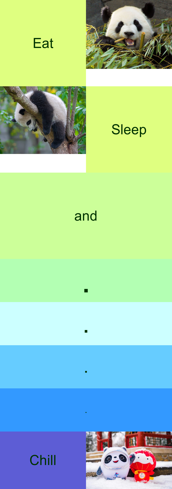

# **My Meme**



# **R code**
```
library("magick")
#Meme consists of top big block with 4 small squares, following by an "and" text square and series of dots connecting a bottom row.

#Make small squares of the top big block
eat_text <- image_blank(width = 500,
                        height = 500,
                        color = "#dfff80") %>%
  image_annotate(text = "Eat", 
                 color = "#003300",
                 size = 80,
                 font = "Courier",
                 gravity = "center")

panda_eating <- image_read("https://gimg2.baidu.com/image_search/src=http%3A%2F%2F5b0988e595225.cdn.sohucs.com%2Fimages%2F20181103%2F228556c6267c4876b82f8bcd9761d969.png&refer=http%3A%2F%2F5b0988e595225.cdn.sohucs.com&app=2002&size=f9999,10000&q=a80&n=0&g=0n&fmt=auto?sec=1650448897&t=9d94cc8d0469118ab939e0e4b04f96b3") %>%
  image_scale(500)

sleep_text <- image_blank(width = 500,
                          height = 500,
                          color = "#dfff80") %>%
  image_annotate(text = "Sleep", 
                 color = "#003300",
                 size = 80,
                 font = "Courier",
                 gravity = "center")

panda_sleeping <- image_read("https://media.istockphoto.com/photos/young-panda-bear-sleeping-in-tree-picture-id482324593?k=20&m=482324593&s=612x612&w=0&h=r7tybThy4avcWYXZHHcA5-clk9fTcDbefvlphw3FqOc=") %>%
  image_scale(500)


# and text square that is double the width of the previous squares
and_text <- image_blank(width = 1000,
                        height = 500,
                        color = "#ccff99") %>%
  image_annotate(text = "and", 
                 color = "#003300",
                 size = 80,
                 font = "Courier",
                 gravity = "center")

# squares of dots with beautiful colours
dot1 <- image_blank(width = 1000,
                    height = 250,
                    color = "#b3ffb3") %>%
  image_annotate(text = ".", 
                 color = "#003300",
                 size = 200,
                 font = "Courier",
                 gravity = "center")

dot2 <- image_blank(width = 1000,
                    height = 250,
                    color = "#ccffff") %>%
  image_annotate(text = ".", 
                 color = "#003300",
                 size = 150,
                 font = "Courier",
                 gravity = "center")
dot3 <- image_blank(width = 1000,
                    height = 250,
                    color = "#66ccff") %>%
  image_annotate(text = ".", 
                 color = "#003300",
                 size = 100,
                 font = "Courier",
                 gravity = "center")
dot4 <- image_blank(width = 1000,
                    height = 250,
                    color = "#3399ff") %>%
  image_annotate(text = ".", 
                 color = "#003300",
                 size = 50,
                 font = "Courier",
                 gravity = "center")

# square of chill text
chill_text <- image_blank(width = 500,
                          height = 333,
                          color = "#5d5dd5") %>%
  image_annotate(text = "Chill", 
                 color = "#003300",
                 size = 80,
                 font = "Courier",
                 gravity = "center")

# last square
panda <- image_read("https://gimg2.baidu.com/image_search/src=http%3A%2F%2Fimagepphcloud.thepaper.cn%2Fpph%2Fimage%2F179%2F243%2F264.jpg&refer=http%3A%2F%2Fimagepphcloud.thepaper.cn&app=2002&size=f9999,10000&q=a80&n=0&g=0n&fmt=auto?sec=1650447030&t=634ef154b8cd9e45abea31bf7d571394") %>%
  image_scale(500)

#Combine

#first row
eat_vector <- c(eat_text, panda_eating)
first <- image_append(eat_vector)

#second row
second <- image_append(c(panda_sleeping, sleep_text))

#top big square consists of 4 little
top <- image_append(c(first, second), stack = TRUE)

#stack of dots
dots <- image_append(c(dot1, dot2, dot3, dot4), stack = TRUE)

#bottom pic
bottom_row <- image_append(c(chill_text, panda))

#together
meme <- c(top, and_text, dots, bottom_row) %>%
  image_append(stack = TRUE)

meme

image_write(meme, "A1PartAMeme.png")

```

# Why create this meme?

I want to remind myself that other than studying, I need to:
* eat
* sleep
* *chill!* 

# What is in the meme?
1. Picture of panda **eatting** bamboo
2. Picture of a baby panda **sleeping**
3. Picture of Bing Dwen Dwen **chilling**

## Learn more about [bing dwendwen](https://olympics.com/en/beijing-2022/mascot)


## Learn more about [panda's bamboo diet](https://www.science.org/content/article/how-pandas-survive-their-bamboo-only-diet#:~:text=The%20two%20bamboo%20species%20in,rich%20in%20nitrogen%20and%20phosphorous.)


